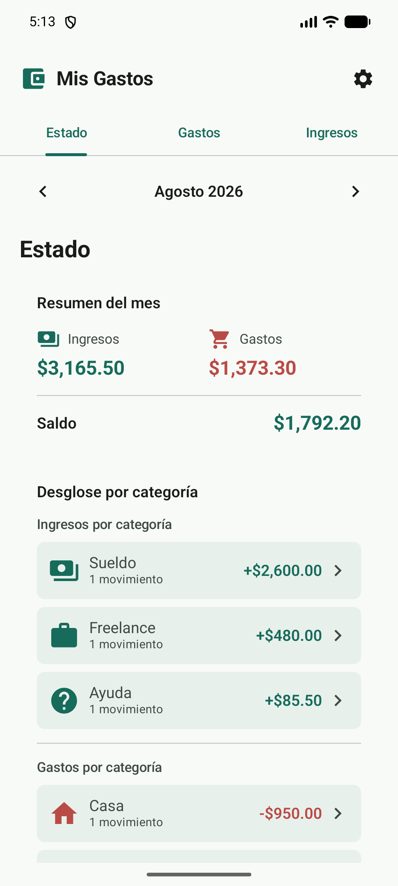
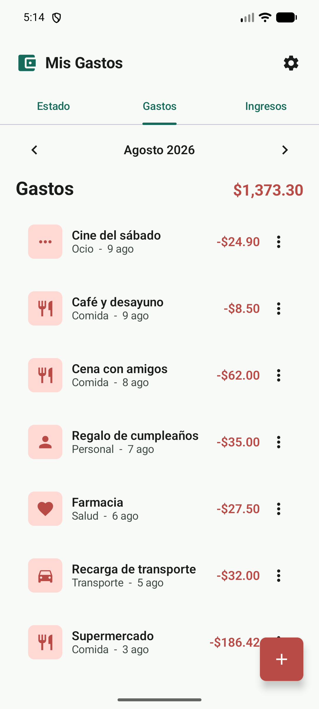
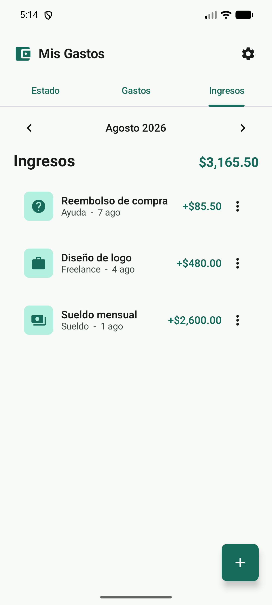

# Mis Gastos

<p align="center">
  <strong>Una forma simple de entender a dónde va tu dinero.</strong><br>
  Registra, organiza y revisa tus gastos e ingresos sin cuentas ni conexión a internet.
</p>

<p align="center">
  
  
  
</p>

<p align="center"><sub>Las capturas usan datos ficticios para mostrar la experiencia con un mes ya en uso.</sub></p>

## Para qué sirve

**Mis Gastos** es una aplicación de finanzas personales pensada para registrar movimientos en pocos segundos y obtener una visión clara del mes.

- **Estado:** resumen mensual, saldo, ahorro y desglose por categoría.
- **Gastos e ingresos:** listas separadas con navegación por mes.
- **Detalle por categoría:** toca una categoría para ver sus transacciones.
- **Categorías personalizables:** créalas, elimínalas y cambia sus íconos desde Ajustes.
- **Privacidad offline:** tus datos permanecen en el dispositivo.
- **Experiencia cuidada:** tema claro/oscuro, feedback háptico, formularios simples y notificaciones integradas en la interfaz.

## Instalar la aplicación

Descarga **[mis_gastos.apk](https://github.com/dottox/Gastos-Tracker/releases/latest/download/mis_gastos.apk)** desde la sección de [Releases](https://github.com/dottox/Gastos-Tracker/releases) e instálalo en un dispositivo Android 14 o superior. Al instalarla fuera de Google Play, Android puede mostrar una advertencia o pedir permiso para instalar aplicaciones desde esa fuente.

La aplicación se llama **Mis Gastos** y el paquete es `com.example.misgastos`.

---

## Cómo empezar (Desarrolladores)

Abre el proyecto en Android Studio y ejecútalo en un dispositivo o emulador con Android 14 o superior.

Desde la terminal:

```bash
./gradlew installDebug
```

---

## Notas técnicas

| Área | Implementación |
| --- | --- |
| Lenguaje | Kotlin, JVM 21 |
| UI | Jetpack Compose + Material 3 |
| Arquitectura | MVVM con una separación básica de datos, dominio y UI |
| Estado | `StateFlow`, `SharedFlow` y `collectAsStateWithLifecycle` |
| Persistencia | Room Database, completamente local |
| Concurrencia | Coroutines; operaciones de Room en `Dispatchers.IO` |
| Navegación | `HorizontalPager` para Estado, Gastos e Ingresos |
| SDK | `minSdk 34`, `targetSdk 36`, `compileSdk 36` |

### Modelo de datos

- `Transaction`: movimiento único con monto, fecha, categoría y `TransactionType` (`GASTO` o `INGRESO`).
- `Category`: categorías separadas por tipo, con nombre e ícono Material persistido.
- `AppSettings`: decimales, objetivo mensual y modo de tema.
- `TransactionDao` y `SettingsDao`: consultas reactivas mediante `Flow`.
- La base de datos incluye migraciones para mantener los datos al incorporar la configuración de íconos.

### Estructura principal

```text
app/src/main/java/com/example/misgastos/
├── data/       # Room, DAO y repositorios
├── domain/     # Estado de UI y formateo de montos
├── ui/
│   ├── components/
│   └── screens/
└── MainViewModel.kt
```

### Verificación

```bash
./gradlew test
./gradlew assembleDebug
./gradlew assembleDebugAndroidTest
```

El manifest no declara permiso de Internet; la app no depende de servicios remotos para funcionar.
